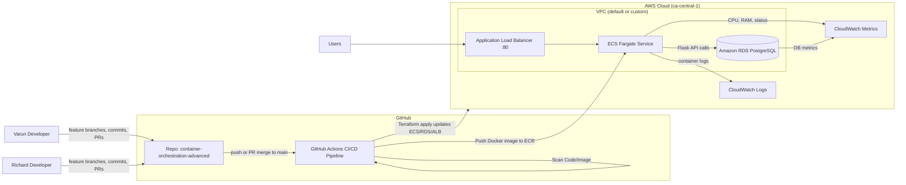

# Capstone CI/CD RDS Application

Complete DevOps Pipeline: GitHub Actions → Terraform → AWS ECS/ECR/RDS → CloudWatch

## 📌 Overview

This project implements a fully automated CI/CD pipeline and cloud‑native deployment of a Flask-based web application with PostgreSQL. The solution follows modern DevOps best practices, using:

- **GitHub Actions** for CI/CD
- **Terraform** for Infrastructure-as-Code
- **AWS ECS + ECR + RDS** for hosting
- **CloudWatch** for logs and monitoring
- **Docker** for containerization
- **PostgreSQL** local + AWS RDS
- **Automated testing, code scanning, and deployment**

This repository demonstrates end-to-end automation from code → test → scan → deploy.

---

## 🖼 Architecture Diagram


---

## 🚀 Target Architecture



---

## 🗂️ Repository Structure

```
capstone-ci-cd-rds-app/
├── web_app.py              # Flask application (API + frontend)
├── requirements.txt        # Python dependencies
├── Dockerfile              # Container image definition
├── docker-compose.yml      # Local dev stack (app + Postgres)
├── init.sql                # DB init script for local Postgres
├── tests/
│   ├── test_health.py      # /health API tests
│   └── test_users.py       # /users API tests
└── infra/                  # Terraform IaC for AWS
    ├── main.tf
    ├── variables.tf
    ├── outputs.tf
    ├── ecr.tf
    ├── ecs.tf
    ├── rds.tf
    ├── security.tf
    ├── iam.tf
    ├── logs.tf
    └── network.tf
```

---

## 🧪 Application Features & Requirements

### 1. Backend APIs (Flask)

| Endpoint | Function |
|----------|----------|
| GET `/health` | Health check |
| GET `/users` | List users |
| GET `/users/<id>` | Get user by ID |
| POST `/users` | Create a user |

### 2. Frontend

Served via `templates/index.html`

Includes:
- User creation form
- User list table
- Health status display

### 3. Database

- **Local:** PostgreSQL via docker-compose + init.sql
- **Production:** RDS PostgreSQL managed by Terraform

---

## 🛠️ Infrastructure as Code (Terraform)

Terraform provisions:

| Component | Description |
|-----------|-------------|
| ✔️ **AWS ECR** | Stores versioned Docker images. |
| ✔️ **AWS ECS (Fargate)** | Runs the Flask app in a container. |
| ✔️ **Application Load Balancer** | Public entry point (:80). |
| ✔️ **RDS PostgreSQL** | Production DB with subnet group and SG rules. |
| ✔️ **CloudWatch Logging** | Captures container stdout/stderr. |
| ✔️ **IAM roles** | For ECS task execution and ECR access. |
| ✔️ **Remote State Backend** | S3 bucket + DynamoDB lock table |

This ensures collaborative and safe IaC workflows.

---

## 🔄 CI/CD Pipeline (GitHub Actions)

### Triggers

```yaml
on:
  push:
    branches: [ main, "feature/**" ]
  pull_request:
    branches: [ main ]
```

### Pipeline Stages

1. **Source**
   - Checkout code each job.

2. **Build + Test**
   - Install Python dependencies
   - Run pytest with coverage
   - Generate coverage.xml

3. **Code Scanning**
   - Build Docker image → Scan using Trivy.

4. **Deploy** (only on main branch)
   - Configure AWS credentials
   - Login to ECR
   - Build & push Docker image
   - Run Terraform apply (infra updates ECS with new image tag)

**Result:** Full automation from commit → deploy.

---

## 📊 Monitoring & Logging

### CloudWatch Logs
- ECS task uses `awslogs` driver → sends all app logs.

### CloudWatch Metrics
- ECS CPU/memory usage
- ECS task count
- ALB request count & errors
- RDS metrics (CPU, storage, connections)

### Demonstration
1. Create users via UI
2. Confirm logs update
3. Show ECS/RDS dashboards to professor

---

## ▶️ Local Development

Start local environment:
```bash
docker-compose up --build
```

Run tests locally:
```bash
pytest --cov=web_app
```

Open app:
```bash
http://localhost:5000
```

"Demo change for CI"


## 🚧 Challenges Faced & How We Overcame Them

### 1. Database Initialization Failure (Internal Server Error at /users)

**Challenge:**
When accessing `/users`, the application returned `500 Internal Server Error`. Logs showed:
```
psycopg2.errors.UndefinedTable: relation "users" does not exist.
```

**Cause:**
The RDS database did not automatically create the `users` table after deployment.

**Solution:**
- Implemented database auto-initialization using an environment-controlled hook in `web_app.py`.
- Created a consistent `init.sql` to ensure the schema exists in both local Docker and AWS RDS.
- Added `INIT_DB_ON_STARTUP=true` in ECS to run `init_db()` on container startup.

**Outcome:**
Application now boots with the required table already created, preventing runtime database errors.

---

### 2. Flask 3.x Deprecation: before_first_request Removed

**Challenge:**
Tests failed in CI pipeline with:
```
AttributeError: 'Flask' object has no attribute 'before_first_request'.
```

**Cause:**
Flask 3.x removed the `before_first_request` decorator that previous versions used for boot-time initialization.

**Solution:**
- Removed the deprecated decorator.
- Replaced with a safer import-time initialization triggered via environment variable (`INIT_DB_ON_STARTUP`).
- Ensured test suite imports do not initialize external resources.

**Outcome:**
CI tests run without errors, and production still initializes the DB correctly.

---

### 3. CI/CD Pipeline Deployment Issues

**Challenge:**
Pipeline initially failed due to incorrect workflow syntax and missing Terraform environment variables.

**Cause:**
The deployment workflow lacked proper ECR login, Terraform variable passing, and had a broken structure.

**Solution:**
- Rewrote the entire `ci-cd.yml` pipeline to:
  - Add proper ECR authentication
  - Configure Terraform with dynamic `TF_VAR_image_tag`
  - Split stages into Source/Test → Security Scan → Deploy
- Validated with GitHub Actions and Terraform.

**Outcome:**
The pipeline now builds, tests, scans, deploys infrastructure and updates ECS automatically on every main merge.

---

### 4. Destroying Infrastructure Manually

**Challenge:**
Initially, AWS resources (VPC, RDS, ALB, ECS, ECR, IAM) had to be destroyed manually.

**Cause:**
No automated teardown existed, which slowed down iteration.

**Solution:**
- Introduced a dedicated `destroy.yml` workflow triggered manually via GitHub UI.
- Added confirmation step (type "destroy") to avoid accidental deletions.

**Outcome:**
Infrastructure can now be safely torn down with a single GitHub Action.

---

### 5. Difficulty Running SQL Commands from AWS RDS Console

**Challenge:**
AWS Console showed "No databases that support query editor" for RDS.

**Cause:**
The Query Editor only works for Aurora Serverless, not for standard PostgreSQL instances.

**Solution:**
- Connected using EC2 Bastion → `psql` or used local `psql` via SSH tunnel.
- Validated tables and ensured schema creation.

**Outcome:**
Reliable access to RDS for debugging and validation.

---

### 6. ECS Task Failing Due to Wrong Environment Variables

**Challenge:**
Containers failed health checks and crashed due to missing environment variables required to connect to RDS.

**Cause:**
Terraform ECS task definition did not pass DB credentials into the container.

**Solution:**
- Added sensitive variables via Terraform → ECS task definition.
- Defined environment variables: `DB_HOST`, `DB_NAME`, `DB_USER`, `DB_PASSWORD`, `INIT_DB_ON_STARTUP`.

**Outcome:**
Containers now connect to RDS successfully and remain healthy.

---

### 7. Delayed RDS Spin-Up Causing Early Application Failures

**Challenge:**
RDS instances take multiple minutes to initialize, causing ECS tasks to fail during early attempts.

**Solution:**
- Implemented database retry logic through Flask health checks.
- Ensured application gracefully handles temporary DB unavailability.
- Added Auto-Init only on successful DB connection.

**Outcome:**
Deployment stabilizes even when database initialization is slow.