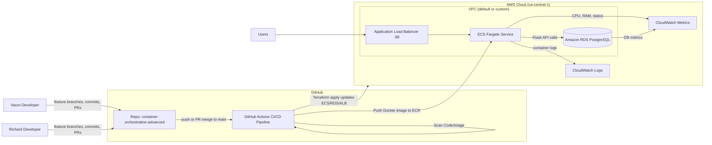

# Capstone CI/CD RDS Application

Complete DevOps Pipeline: GitHub Actions → Terraform → AWS ECS/ECR/RDS → CloudWatch

## 📌 Overview

This project implements a fully automated CI/CD pipeline and cloud‑native deployment of a Flask-based web application with PostgreSQL. The solution follows modern DevOps best practices, using:

- **GitHub Actions** for CI/CD
- **Terraform** for Infrastructure-as-Code
- **AWS ECS + ECR + RDS** for hosting
- **CloudWatch** for logs and monitoring
- **Docker** for containerization
- **PostgreSQL** local + AWS RDS
- **Automated testing, code scanning, and deployment**

This repository demonstrates end-to-end automation from code → test → scan → deploy.

---

## 🚀 Target Architecture



---

## 🗂️ Repository Structure

```
capstone-ci-cd-rds-app/
├── web_app.py              # Flask application (API + frontend)
├── requirements.txt        # Python dependencies
├── Dockerfile              # Container image definition
├── docker-compose.yml      # Local dev stack (app + Postgres)
├── init.sql                # DB init script for local Postgres
├── tests/
│   ├── test_health.py      # /health API tests
│   └── test_users.py       # /users API tests
└── infra/                  # Terraform IaC for AWS
    ├── main.tf
    ├── variables.tf
    ├── outputs.tf
    ├── ecr.tf
    ├── ecs.tf
    ├── rds.tf
    ├── security.tf
    ├── iam.tf
    ├── logs.tf
    └── network.tf
```

---

## 🧪 Application Features & Requirements

### 1. Backend APIs (Flask)

| Endpoint | Function |
|----------|----------|
| GET `/health` | Health check |
| GET `/users` | List users |
| GET `/users/<id>` | Get user by ID |
| POST `/users` | Create a user |

### 2. Frontend

Served via `templates/index.html`

Includes:
- User creation form
- User list table
- Health status display

### 3. Database

- **Local:** PostgreSQL via docker-compose + init.sql
- **Production:** RDS PostgreSQL managed by Terraform

---

## 🛠️ Infrastructure as Code (Terraform)

Terraform provisions:

| Component | Description |
|-----------|-------------|
| ✔️ **AWS ECR** | Stores versioned Docker images. |
| ✔️ **AWS ECS (Fargate)** | Runs the Flask app in a container. |
| ✔️ **Application Load Balancer** | Public entry point (:80). |
| ✔️ **RDS PostgreSQL** | Production DB with subnet group and SG rules. |
| ✔️ **CloudWatch Logging** | Captures container stdout/stderr. |
| ✔️ **IAM roles** | For ECS task execution and ECR access. |
| ✔️ **Remote State Backend** | S3 bucket + DynamoDB lock table |

This ensures collaborative and safe IaC workflows.

---

## 🔄 CI/CD Pipeline (GitHub Actions)

### Triggers

```yaml
on:
  push:
    branches: [ main, "feature/**" ]
  pull_request:
    branches: [ main ]
```

### Pipeline Stages

1. **Source**
   - Checkout code each job.

2. **Build + Test**
   - Install Python dependencies
   - Run pytest with coverage
   - Generate coverage.xml

3. **Code Scanning**
   - Build Docker image → Scan using Trivy.

4. **Deploy** (only on main branch)
   - Configure AWS credentials
   - Login to ECR
   - Build & push Docker image
   - Run Terraform apply (infra updates ECS with new image tag)

**Result:** Full automation from commit → deploy.

---

## 📊 Monitoring & Logging

### CloudWatch Logs
- ECS task uses `awslogs` driver → sends all app logs.

### CloudWatch Metrics
- ECS CPU/memory usage
- ECS task count
- ALB request count & errors
- RDS metrics (CPU, storage, connections)

### Demonstration
1. Create users via UI
2. Confirm logs update
3. Show ECS/RDS dashboards to professor

---

## ▶️ Local Development

Start local environment:
```bash
docker-compose up --build
```

Run tests locally:
```bash
pytest --cov=web_app
```

Open app:
```bash
http://localhost:5000
```


